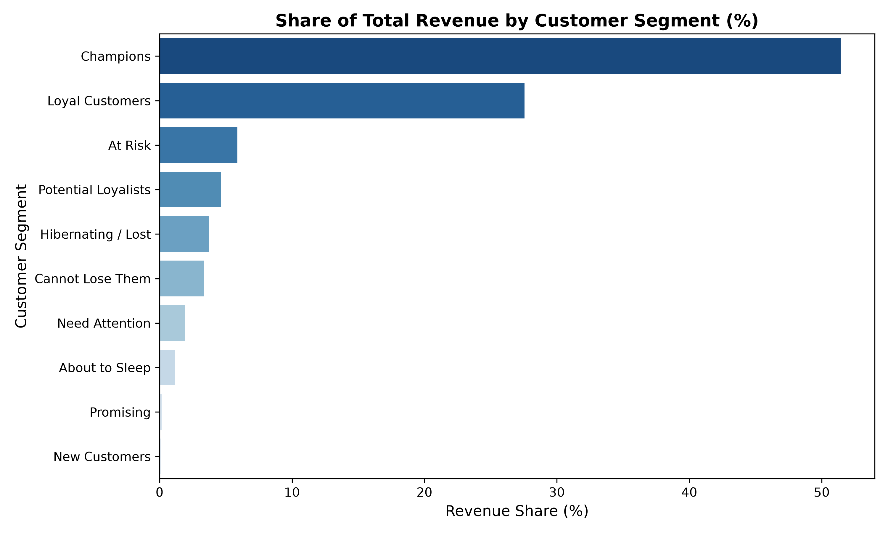
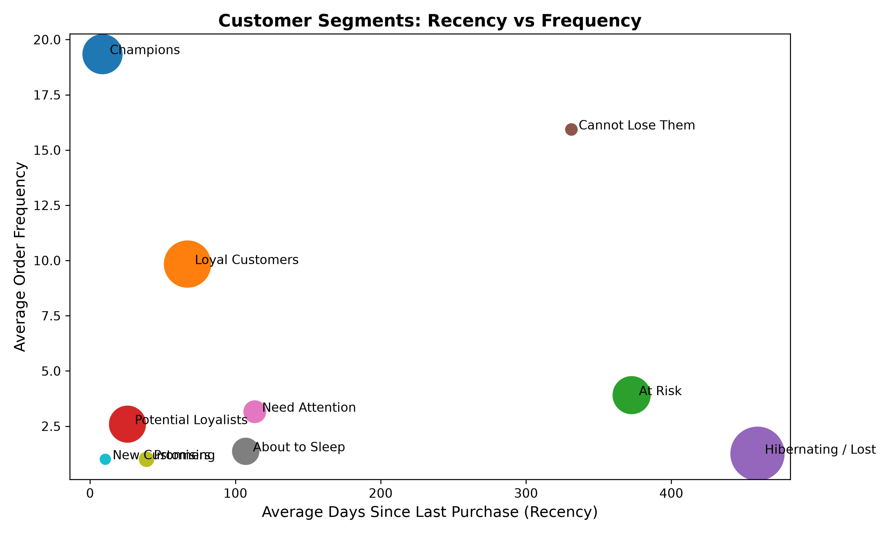

# E-Commerce Customer Segmentation & RFM Analysis

An end-to-end data analytics project uncovering customer purchasing behavior across **1,000,000+ transactions** using **RFM (Recency, Frequency, Monetary) Modeling** and **Python**.

---

## 📌 Executive Summary
Analyzing transactional data from an international online retail store reveals that **34% of the customer base generates ~79% of total revenue**. This project segments 5,878 active customers into strategic tiers, providing actionable marketing strategies to maximize Customer Lifetime Value (CLV) and curb churn.

---

## 📊 Key Business Findings

| Customer Segment | Customer Share (%) | Revenue Share (%) | Avg. Monetary Value | Core Business Action |
| :--- | :---: | :---: | :---: | :--- |
| **Champions** | 14.24% | **51.42%** | £10,901.13 | Reward loyalty, early product access, VIP concierge |
| **Loyal Customers** | 19.75% | **27.56%** | £4,211.84 | Upsell/cross-sell, offer loyalty rewards |
| **At Risk** | 12.81% | 5.87% | £1,382.10 | Win-back email discounts, feedback surveys |
| **Cannot Lose Them** | 1.21% (71 users) | 3.34% | £8,355.68 | Direct sales outreach, high-priority retention incentives |
| **Hibernating / Lost** | 25.91% | 3.76% | £438.03 | Low-cost automated re-engagement or deprioritize ad spend |

---

## 📈 Visualizations

### 1. Revenue Share by Customer Segment
Champions alone account for over half of all generated business revenue.

### 2. Segment Behavioral Mapping (Recency vs. Frequency)
Bubble size reflects customer volume in each segment.

---

## 🛠️ Data Pipeline & Methodology
1. **Data Cleaning & Preprocessing:** 
   * Filtered missing records and removed cancelled orders (`Invoice` starting with 'C').
   * Screened for anomalous negative quantities and pricing inconsistencies.
2. **Feature Engineering & Metric Computation:**
   * Calculated **Recency** (days since last purchase), **Frequency** (total distinct invoices), and **Monetary Value** (total spent).
3. **RFM Scoring & Segmentation:**
   * Divided metrics into quintiles (1–5) using `pd.qcut` with percentile rank scaling.
   * Mapped behavioral segments using industry-standard RF matrices.

---

## 💻 Tech Stack
* **Language:** Python 3
* **Libraries:** Pandas, NumPy, Matplotlib, Seaborn
* **Environment:** VS Code, Git